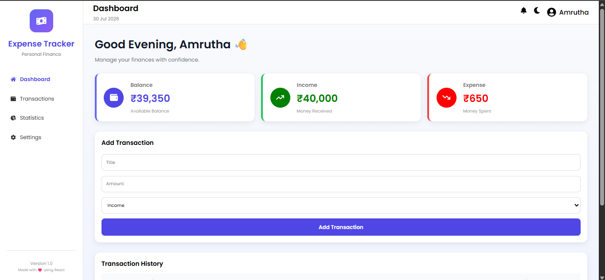
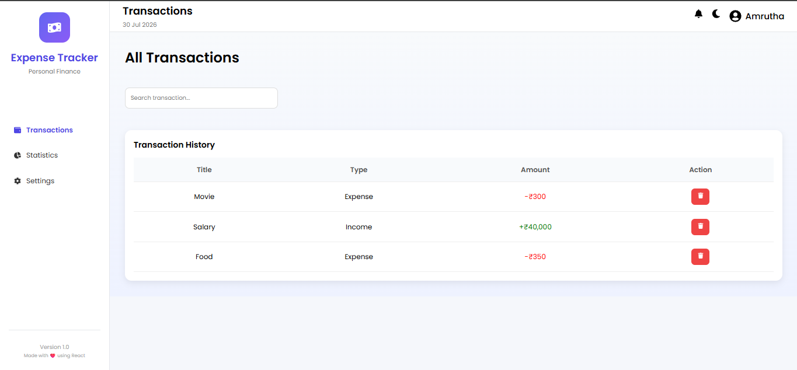
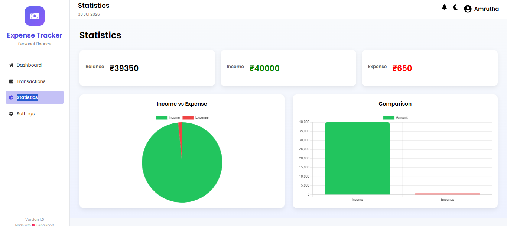
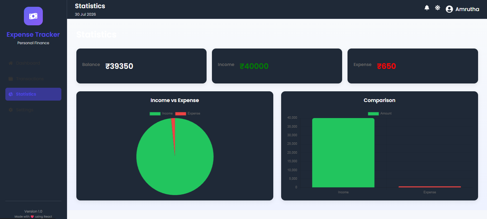

# 💰 Expense Tracker

A modern and responsive Expense Tracker Dashboard built using React. The application helps users manage their income and expenses, track their financial balance, and visualize spending through interactive charts.

---

## 🚀 Features

- 📊 Dashboard with Balance, Income, and Expense summary
- ➕ Add new transactions
- 🗑️ Delete transactions
- 🔍 Search transactions
- 🌙 Dark / Light mode
- 📈 Statistics with Pie Chart and Bar Chart
- 💾 Data persistence using Local Storage
- 📱 Responsive user interface
- 🧭 Sidebar navigation using React Router

---

## 🛠️ Tech Stack

- React.js
- JavaScript (ES6+)
- React Router DOM
- Chart.js
- React Icons
- CSS3
- Local Storage
- Vite

---

## 📂 Project Structure

```
expense-tracker/
│
├── public/
├── src/
│   ├── components/
│   ├── pages/
│   ├── styles/
│   ├── App.jsx
│   └── main.jsx
│
├── package.json
├── vite.config.js
└── README.md
```

---

## ⚙️ Installation

Clone the repository:

```bash
git clone https://github.com/Amrutha3690/expense-tracker.git
```

Navigate to the project folder:

```bash
cd expense-tracker
```

Install dependencies:

```bash
npm install
```

Run the development server:

```bash
npm run dev
```

---

## 📸 Screenshots

### Dashboard


### Transactions


### Statistics


### Dark Mode


---

## 🔮 Future Improvements

- Edit transactions
- Monthly expense reports
- Export transactions to PDF/CSV
- User authentication
- Backend integration with a database

---

## 👩‍💻 Developer

**Amrutha Ratna Valli Uppuganti**

GitHub: https://github.com/Amrutha3690

---

## 📄 License

This project is created for learning and portfolio purposes.
